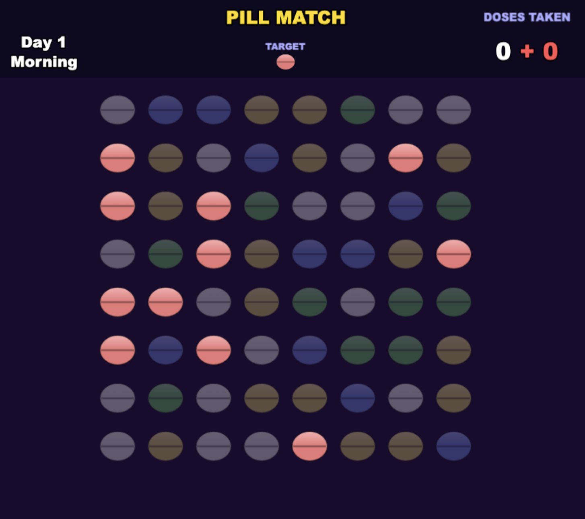

# 💊 Pill Match

A prescription-themed **Match-3** puzzle game. Follow the doctor's orders, take your medicine in the right order — morning and evening — and survive a full week without overdosing.

Built with [Phaser 4](https://phaser.io), [Vite](https://vitejs.dev) and [TypeScript](https://www.typescriptlang.org). All pill art is drawn in code, so the game ships with **zero image assets**.



---

## 🎭 Concept — Telling a Story Through Mechanics

Pill Match is a small experiment in **using game mechanics to tell a story**. Rather than delivering its message through cutscenes or text, it lets the *rules themselves* carry the meaning.

The story is about something everyday and important: **the safety of taking medicine correctly.** Take the right pills, in the right order, at the right time of day — and don't take more than you're prescribed.

To tell it, the game borrows one of the most familiar and approachable formats there is — the **Match-3 puzzle** — and bends it toward that message. Because almost everyone already knows how to play a Match-3, the player's attention is free to land on what the mechanics are *saying*:

| In the game… | …stands for |
|---|---|
| The prescription dialog | The doctor's orders for the day |
| Clearing the required color | Taking a prescribed dose |
| The required order of colors | Following the regimen as directed |
| Clearing any other color | Taking the wrong pill — an overdose |
| Surviving the week | Managing your medication safely over time |

The goal isn't a clever puzzle for its own sake — it's to have the player *feel*, through play, the difference between taking medicine as prescribed and taking too much.

---

## 🎯 The Goal

Each day you receive a **prescription**: one to three pill colors you must take **in a specific order**. There are two doses a day — **morning** and **evening**.

**Survive 7 days with a positive score to win.**

You lose if you:
- finish the week with a **negative score**,
- **overdose** — let the wrong-color pills you take reach **double** the prescribed pills, or
- run out of **moves**.

---

## 🕹️ How to Play

1. A prescription dialog shows the pills you need and their order. Press **OK**.
2. **Click a pill**, then **click an adjacent pill** to swap them.
3. A swap only counts if it forms a match of **3+ in a row or column**.
4. **Only the currently required color clears** and advances your prescription. Clearing other colors still happens, but those are *overdoses* — they cost you.
5. Work through the prescription, then the next dose, then the next day.

You have **60 moves**. A move is only spent on a swap that produces a match. If you get stuck with no valid move for the required color, the board reshuffles.

### Scoring

| Action | Effect |
|---|---|
| Clear a **prescribed** (required-color) pill | **+10** × cascade multiplier |
| Clear a **wrong-color** pill (overdose) | **−20** each |
| Cascades (chain reactions) | Increase the score multiplier within a turn |

The "Doses Taken" counter reads as `9 + 3` — **9** taken as prescribed (white) and **+3** overdoses (red). The red figure **flashes** as a danger warning once your overdoses exceed your prescribed count, and a fatal overdose (2× prescribed) ends the game.

---

## ✨ Features

- **No art assets** — all five pill sprites are generated at runtime with the Canvas API.
- **Prescription system** — configurable dialogs with ordered, multi-pill doses.
- **Day cycle** — two doses per day (morning / evening) across a 7-day run.
- **Overdose penalty** with an escalating, flashing danger indicator.
- **Win / lose** outcome screen driven by your final score.
- **Fit-to-window scaling** — the canvas scales to any window size without clipping.

---

## 🧩 Game Design — Inverting the Match-3 Rules

In a classic Match-3 (Bejeweled, Candy Crush, and friends), the message of the mechanics is simple: **more is always better.** Clear as much as you can, chain big cascades, and push the score ever upward. There is no such thing as matching "too much."

For a game about medication safety, that incentive is exactly backwards — so the **win/loss condition and the scoring system are deliberately changed** to shift the focus from *greed* to *discipline*:

| | Classic Match-3 | Pill Match |
|---|---|---|
| **Objective** | Maximize score / clear the board | Survive 7 days, taking each dose as prescribed |
| **Every match** | Always rewarded | Only the **prescribed color** is rewarded |
| **Clearing more** | Always better | Wrong-color clears are **overdoses** — penalized |
| **Score direction** | Only goes up | Can go **down**, even negative |
| **Winning** | Reach a target score / level | End the week with a **positive** score |
| **Losing** | Run out of moves | Out of moves, **negative score**, or a **fatal overdose** |

A few design choices reinforce the shift:

- **Restraint beats greed.** Since wrong-color matches subtract points (and can be fatal), the optimal play is *not* to clear everything in sight — it's to take only what you need. The familiar Match-3 impulse becomes the thing to resist.
- **The score can go negative.** Removing the usual "score only goes up" floor lets the penalty actually mean something, and makes a net-negative week a genuine loss rather than a low high-score.
- **Survival, not a high score.** There is no target number to chase. The goal is simply to make it through the week without harming yourself — a softer, more human win condition than "beat your best."
- **Make the tension legible.** The `9 + 3` doses readout shows prescribed and overdose counts side by side, and the red figure **flashes** as overdoses climb — so the player can always see the safe/unsafe balance they're managing.

The result is a Match-3 whose *rules argue for moderation* — the mechanics themselves make the point the game is about.

---

## 🛠️ Tech Stack

- **[Phaser 4](https://github.com/phaserjs/phaser)** — game engine (WebGL/Canvas)
- **[Vite 6](https://vitejs.dev)** — dev server & bundler
- **[TypeScript 5.7](https://www.typescriptlang.org)** — type-checked source

---

## 🚀 Getting Started

### Prerequisites

- **Node.js 18 or newer** (Vite 6 requires it; Node 20+ LTS recommended).

### Install & run

```bash
npm install      # install dependencies
npm run dev      # start the dev server at http://localhost:8080
```

Then open **http://localhost:8080** in your browser. Vite hot-reloads on save.

### Build for production

```bash
npm run build    # output to dist/
```

Upload the contents of `dist/` to any static web host to deploy.

> The `dev` / `build` scripts send a single anonymous ping (template name, dev/prod, Phaser version) via `log.js`. Use `npm run dev-nolog` / `npm run build-nolog` to skip it, or delete `log.js` and remove it from `package.json` scripts.

---

## ⚙️ Configuration & Tuning

Game balance lives in a few easy-to-edit places:

**Prescriptions** — `src/game/config/prescriptions.ts`
Add, edit, or reorder the doses. Even-indexed entries are morning doses, odd-indexed are evening; keep an even number of entries so the pattern stays aligned. Each entry is a message and an ordered list of 1–3 pill colors (`0=red 1=blue 2=yellow 3=green 4=white`).

**Balance constants** — top of `src/game/scenes/Game.ts`

| Constant | Default | Meaning |
|---|---|---|
| `INITIAL_MOVES` | `60` | Moves allowed before game over |
| `DOSES_PER_DAY` | `2` | Doses per day (morning / evening) |
| `DAYS_TO_SURVIVE` | `7` | Days to survive to win |
| `OVERDOSE_PENALTY` | `20` | Points lost per overdose pill |

---

## 🍴 Fork It & Tell Your Own Story

The engine is intentionally decoupled from the story it tells. The Match-3 board, scoring, and day cycle are generic — the *meaning* lives in the prescriptions, the copy, and a handful of constants. That makes Pill Match a good starting point for telling a **different** story with the same mechanics (a different health message, a routine, a habit — anything that maps onto "do the right thing in the right order, and don't overdo it").

### Fork and run

```bash
# Fork on GitHub (the "Fork" button), or with the GitHub CLI:
gh repo fork PlayableStories/pill-match --clone

cd pill-match
npm install      # Node 18+
npm run dev      # http://localhost:8080
```

### Where to start changing things

| To change… | Edit… |
|---|---|
| **The story** — dialog, dose order, regimen | `src/game/config/prescriptions.ts` |
| **The pacing & stakes** — days, doses/day, moves, penalty | constants at the top of `src/game/scenes/Game.ts` |
| **The win/lose framing & end screen** | `src/game/scenes/Game.ts` (`triggerGameOver`) and `src/game/scenes/GameOver.ts` |
| **The look** — pill colors & shapes | `src/game/PillTextures.ts` |
| **The sound** | `src/game/PillAudio.ts` |
| **The title screen & objective text** | `src/game/scenes/MainMenu.ts` |

A good first exercise: open `prescriptions.ts`, rewrite the messages and pill orders to a story of your own, and watch the same mechanics carry a completely different meaning — no engine code required.

> 📓 `DEVLOG.md` documents every file and the reasoning behind each decision — read it before making deeper changes. Pull requests and forks are welcome.

---

## 📁 Project Structure

| Path | Description |
|---|---|
| `index.html` | Page hosting the game canvas |
| `src/main.ts` | App bootstrap |
| `src/game/main.ts` | Phaser config — scaling and the scene list |
| `src/game/scenes/` | Boot, Preloader, MainMenu, Game, GameOver scenes |
| `src/game/PillGrid.ts` | Grid data + sprite management (match/gravity/refill) |
| `src/game/PillTextures.ts` | Programmatic pill texture generation |
| `src/game/PillAudio.ts` | Sound effects |
| `src/game/config/prescriptions.ts` | Prescription definitions |
| `src/game/types.ts` | Shared TypeScript types |
| `public/` | Static assets served as-is |
| `DEVLOG.md` | Detailed development log of each file and decision |

---

## 🙏 Credits

- Created by **William Wong**.
- Bootstrapped from the [Phaser Vite + TypeScript template](https://github.com/phaserjs/template-vite-ts) by Phaser Studio.

## 📄 License

Released under the [MIT License](LICENSE).
